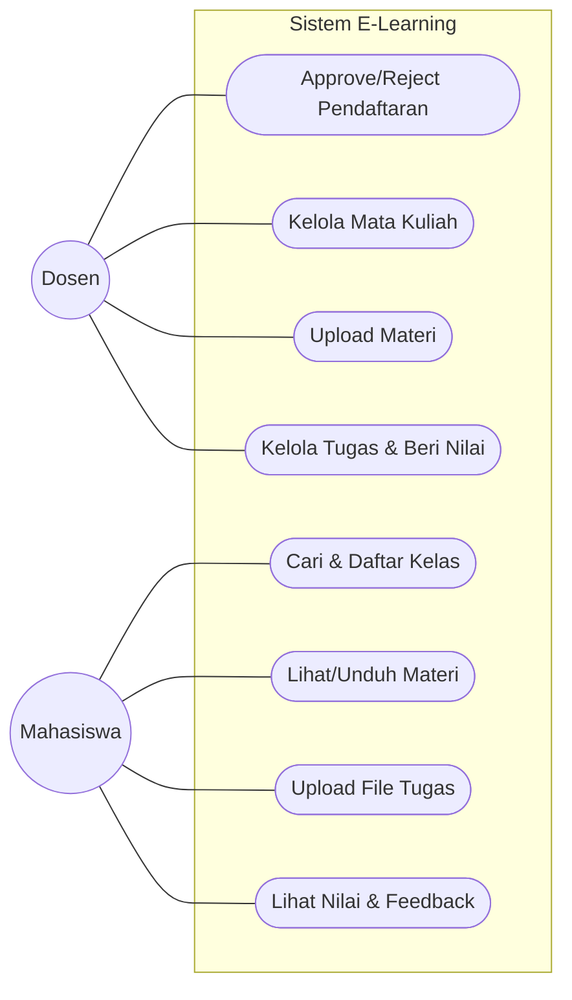
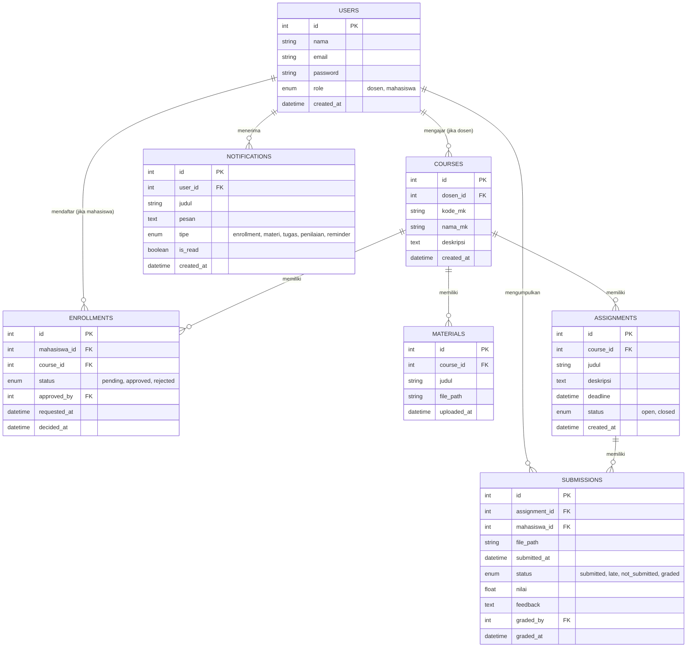
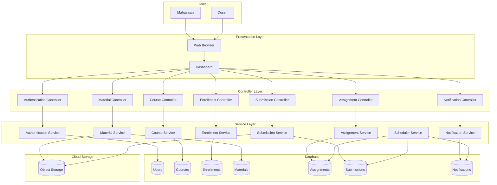

<p align="center">

</p>

<h1 align="center">ELEAR — Sistem Informasi E-Learning</h1>

<p align="center">
Platform pembelajaran daring sederhana dengan dua peran (Dosen &amp; Mahasiswa), lengkap dengan alur persetujuan kelas, upload materi &amp; tugas, penilaian, notifikasi otomatis, dan proses terjadwal (cron).
</p>

<p align="center">


</p>

---

## Daftar Isi

- [Tentang Proyek](#tentang-proyek)
- [Fitur Utama](#fitur-utama)
- [Peran Pengguna](#peran-pengguna)
- [Struktur Database (ERD)](#struktur-database-erd)
- [Arsitektur Sistem](#arsitektur-sistem)
- [Proses Terjadwal (Scheduled Job)](#proses-terjadwal-scheduled-job)
- [Teknologi yang Digunakan](#teknologi-yang-digunakan)
- [Instalasi & Menjalankan Proyek](#instalasi--menjalankan-proyek)
- [Menjalankan Scheduler / Cron](#menjalankan-scheduler--cron)
- [Struktur Direktori](#struktur-direktori)
- [Kontribusi](#kontribusi)
- [Lisensi](#lisensi)

---

## Tentang Proyek

**ELEAR** adalah sistem informasi e-learning sederhana yang dibangun menggunakan **Laravel**. Sistem ini dirancang untuk mendukung interaksi antara **Dosen** dan **Mahasiswa** dalam sebuah kelas daring, mulai dari pendaftaran kelas, distribusi materi, pengumpulan tugas, hingga penilaian — dengan notifikasi dan proses otomatis di background.

| Kebutuhan | Implementasi |
|---|---|
| Minimal 2 role | **Dosen** dan **Mahasiswa** |
| Approval / verifikasi | Mahasiswa mengajukan pendaftaran kelas → **Dosen approve/reject** |
| File upload | Dosen upload **materi**, Mahasiswa upload **file tugas** |
| Notifikasi otomatis | Perubahan status pendaftaran, materi baru, tugas dinilai |
| Proses terjadwal (cron) | Reminder deadline tugas (H-1) & auto-close pengumpulan tugas |
| Cloud | Penyimpanan file materi/tugas via **Object Storage** |

---

## Fitur Utama

### ‍ Akses Dosen
- Dashboard ringkasan kelas, mahasiswa, dan tugas yang belum dinilai
- Kelola mata kuliah/kelas (tambah, edit, hapus)
- Approve/reject pendaftaran mahasiswa
- Upload dan kelola materi kuliah
- Buat & kelola tugas beserta deadline
- Penilaian tugas dan pemberian feedback
- Notifikasi & manajemen profil

### ‍ Akses Mahasiswa
- Dashboard ringkasan kelas & deadline terdekat
- Cari dan mendaftar ke kelas (menunggu approval dosen)
- Lihat kelas yang sudah disetujui
- Lihat/unduh materi kuliah
- Upload file jawaban tugas sebelum deadline
- Lihat nilai & feedback dari dosen
- Notifikasi & manajemen profil

---

## ‍‍ Peran Pengguna



---

## ️ Struktur Database (ERD)



---

## ️ Arsitektur Sistem



Sistem mengikuti pola **Controller → Service → Model**, dengan file materi dan tugas disimpan di **Object Storage** (cloud), bukan disk lokal.

---

##  Proses Terjadwal (Scheduled Job)

| Job | Jadwal | Aksi |
|---|---|---|
| Reminder deadline tugas | Setiap hari (H-1 sebelum deadline) | Kirim notifikasi ke mahasiswa yang belum submit |
| Auto-close tugas | Setiap hari/jam | Ubah status tugas jadi `closed` bila lewat deadline; tandai submission yang belum dikumpulkan sebagai `not_submitted` |

---

## ️ Teknologi yang Digunakan

- **Backend:** Laravel (PHP)
- **Database:** MySQL / MariaDB
- **Frontend:** Blade / Vite (sesuaikan dengan implementasi Anda)
- **Queue & Scheduler:** Laravel Task Scheduling (`php artisan schedule:run`)
- **Storage:** Laravel Filesystem (lokal / cloud object storage, mis. AWS S3)

---

## Instalasi & Menjalankan Proyek

### 1. Prasyarat

Pastikan sudah terinstal:
- PHP >= 8.2
- Composer
- Node.js & NPM
- MySQL / MariaDB
- Git

### 2. Clone Repository

```bash
git clone https://github.com/username/elear.git
cd elear
```

### 3. Install Dependency

```bash
composer install
npm install
```

### 4. Konfigurasi Environment

Salin file environment lalu generate application key:

```bash
cp .env.example .env
php artisan key:generate
```

Buka file `.env` dan sesuaikan konfigurasi database:

```env
DB_CONNECTION=mysql
DB_HOST=127.0.0.1
DB_PORT=3306
DB_DATABASE=elear
DB_USERNAME=root
DB_PASSWORD=
```

Jika menggunakan cloud object storage (opsional), tambahkan juga kredensial storage (mis. S3) di `.env`.

### 5. Migrasi & Seeder Database

Buat database `elear` terlebih dahulu di MySQL, lalu jalankan:

```bash
php artisan migrate --seed
```

### 6. Buat Symbolic Link Storage

Agar file upload (materi/tugas) bisa diakses publik:

```bash
php artisan storage:link
```

### 7. Build Asset Frontend

```bash
npm run dev
```

Untuk build production:

```bash
npm run build
```

### 8. Jalankan Server Laravel

```bash
php artisan serve
```

Aplikasi dapat diakses melalui:

```
http://127.0.0.1:8000
```

---

## ⏱️ Menjalankan Scheduler / Cron

Fitur **reminder deadline** dan **auto-close tugas** berjalan melalui Laravel Task Scheduler. Saat pengembangan lokal, jalankan:

```bash
php artisan schedule:work
```

Untuk lingkungan production (server Linux), tambahkan cron job berikut (edit dengan `crontab -e`):

```bash
* * * * * cd /path-to-elear && php artisan schedule:run >> /dev/null 2>&1
```

Cron di atas akan memicu Laravel Scheduler setiap menit, yang kemudian menjalankan job sesuai jadwal masing-masing (harian untuk reminder & auto-close).

---

## Struktur Direktori (ringkas)

```
elear/
├── app/
│ ├── Http/Controllers/ # Authentication, Course, Enrollment, Material, Assignment, Submission, Notification
│ ├── Models/ # Users, Courses, Enrollments, Materials, Assignments, Submissions, Notifications
│ ├── Services/ # Business logic tiap modul
│ └── Console/Commands/ # Scheduled job: reminder & auto-close
├── database/
│ ├── migrations/
│ └── seeders/
├── resources/views/ # Blade templates
├── routes/
│ └── web.php
└── README.md
```

---

## Kontribusi

Kontribusi sangat terbuka! Silakan buat *pull request* atau buka *issue* untuk melaporkan bug maupun mengusulkan fitur baru.

1. Fork repository ini
2. Buat branch baru (`git checkout -b fitur-baru`)
3. Commit perubahan (`git commit -m 'Menambahkan fitur X'`)
4. Push ke branch (`git push origin fitur-baru`)
5. Buka Pull Request

---

## Lisensi

Proyek ini menggunakan framework [Laravel](https://laravel.com) yang berlisensi [MIT](https://opensource.org/licenses/MIT). Sesuaikan bagian ini dengan lisensi proyek ELEAR Anda sendiri.

---

<p align="center">Dibuat dengan ️ menggunakan Laravel</p>
