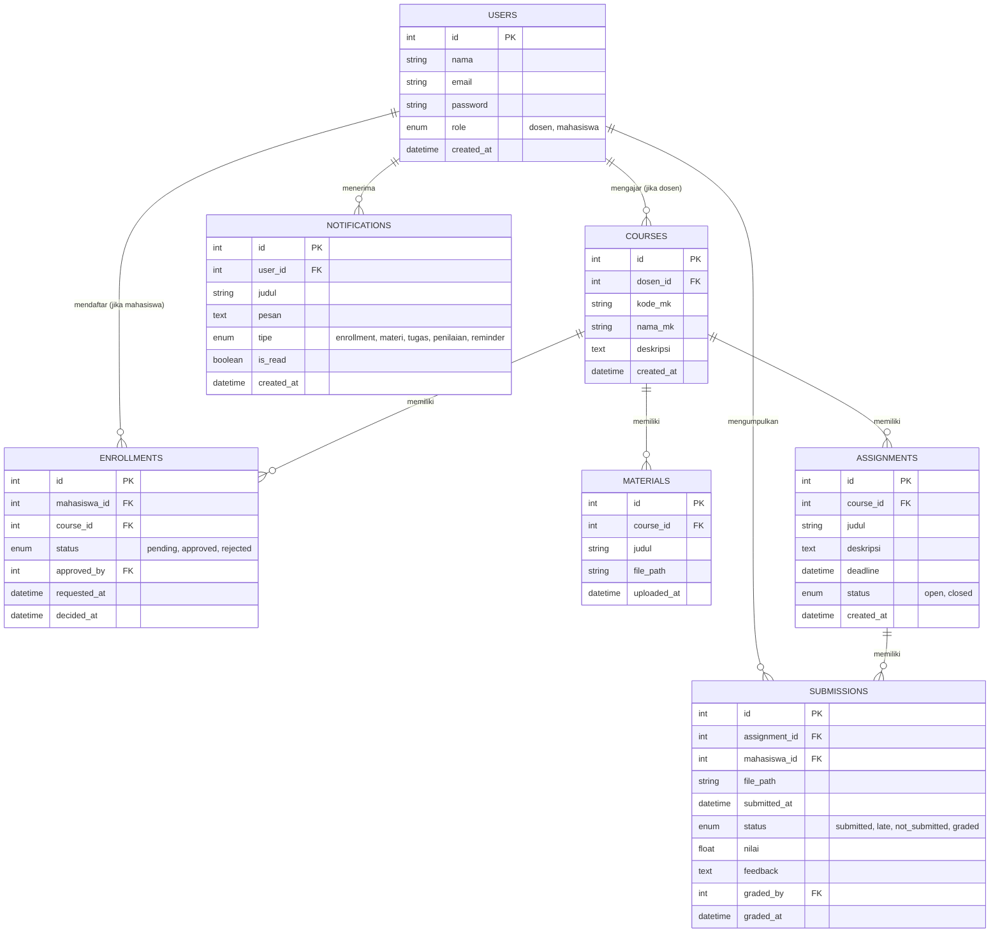
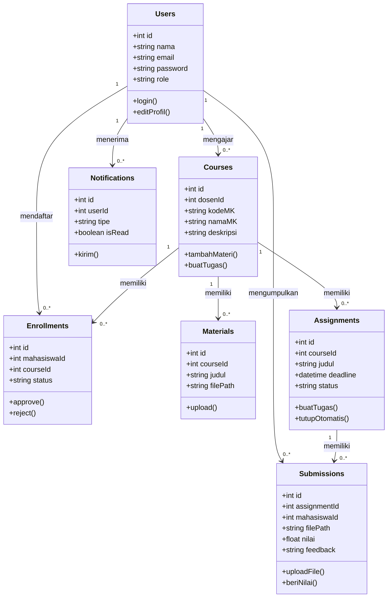
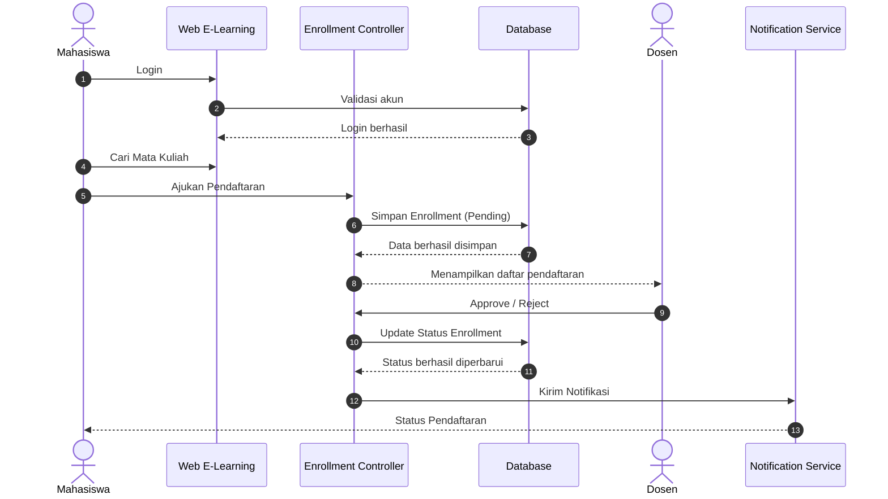
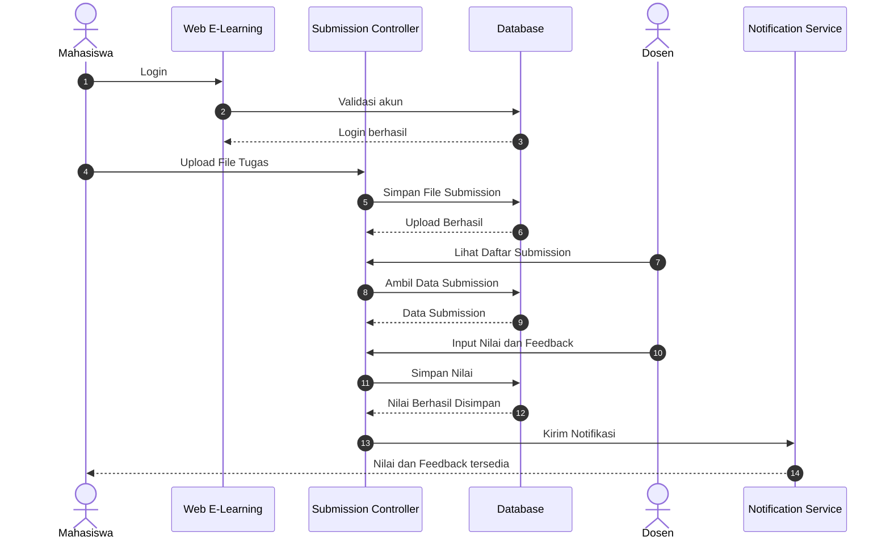
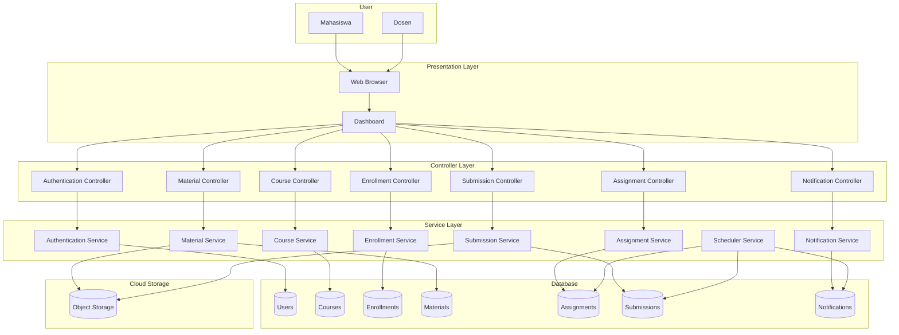

# ELEAR
Sistem Informasi Elearning 
# Desain Sistem — Web E-Learning Sederhana (Akses Dosen & Mahasiswa)

## 1. Ringkasan Konsep

| Elemen wajib tugas | Implementasi di sistem ini |
|---|---|
| Minimal 2 role | **Dosen** dan **Mahasiswa** |
| Approval/verifikasi | Mahasiswa mengajukan pendaftaran kelas → **Dosen approve/reject** |
| File upload | Dosen upload **materi**, Mahasiswa upload **file tugas** |
| Notifikasi otomatis | Notifikasi in-app/email saat: status pendaftaran berubah, materi baru, tugas dinilai |
| Proses terjadwal (cron) | **Reminder deadline tugas (H-1)** dan **auto-close pengumpulan tugas** yang lewat deadline |

Flowchart alur pendaftaran kelas (login → ajukan → review dosen → approve/reject → notifikasi) sudah ditampilkan sebagai diagram di atas — gunakan sebagai dasar **Activity Diagram** pada dokumentasi UML.

---

## 2. Struktur Database (ERD)

### Catatan tabel
- **ENROLLMENTS** adalah tabel kunci untuk proses approval (Bagian 2 tugas): status `pending` dibuat mahasiswa, diubah dosen menjadi `approved`/`rejected`.
- **SUBMISSIONS.status** diisi otomatis oleh scheduled job: jika sudah lewat deadline dan belum ada file → `not_submitted`; jika submit setelah deadline → `late`.
- **NOTIFICATIONS** dipicu oleh event (enrollment disetujui/ditolak, materi baru, tugas dinilai) dan oleh cron job (reminder deadline).

---

## 3. Menu & Fitur per Role

### 3.1 Akses Dosen

| Menu | Fitur |
|---|---|
| Dashboard | Ringkasan: jumlah kelas diampu, mahasiswa terdaftar, tugas belum dinilai |
| Kelola Mata Kuliah | Tambah/edit/hapus mata kuliah/kelas yang diampu |
| Persetujuan Pendaftaran | Lihat daftar mahasiswa yang mengajukan (pending) → **approve/reject** |
| Materi Kuliah | Upload, edit, hapus file materi per kelas |
| Kelola Tugas | Buat tugas baru, atur deadline, lihat status (open/closed) |
| Penilaian | Lihat daftar submission per tugas, beri **nilai & feedback** |
| Notifikasi | Daftar notifikasi (pendaftaran baru masuk, dsb.) |
| Profil | Edit profil, ganti password |

### 3.2 Akses Mahasiswa

| Menu | Fitur |
|---|---|
| Dashboard | Ringkasan: kelas diikuti, tugas mendatang & deadline terdekat |
| Cari & Daftar Kelas | Cari mata kuliah, ajukan pendaftaran (status pending → approved/rejected) |
| Kelas Saya | Daftar kelas yang sudah disetujui |
| Materi Kuliah | Lihat/unduh materi per kelas yang diikuti |
| Tugas | Lihat daftar tugas, **upload file jawaban** sebelum deadline |
| Nilai | Lihat nilai & feedback dari dosen per tugas |
| Notifikasi | Status pendaftaran, materi baru, tugas dinilai, reminder deadline |
| Profil | Edit profil, ganti password |

---

## 4. Proses Terjadwal (Scheduled Job / Cron)

| Job | Jadwal | Aksi |
|---|---|---|
| Reminder deadline tugas | Setiap hari (cek H-1 sebelum deadline) | Kirim notifikasi ke mahasiswa yang belum submit |
| Auto-close tugas | Setiap hari / tiap jam | Ubah `assignments.status` jadi `closed` bila lewat deadline; tandai submission mahasiswa yang belum mengumpulkan sebagai `not_submitted` |

Ini memenuhi syarat "minimal satu proses terjadwal/otomatis di background" pada Bagian 2 dokumen tugas.

---

## 5. Pemetaan ke Kriteria Tugas

# Desain Sistem — Web E-Learning Sederhana (Akses Dosen & Mahasiswa)

## 1. Ringkasan Konsep

| Elemen wajib tugas | Implementasi di sistem ini |
|---|---|
| Minimal 2 role | **Dosen** dan **Mahasiswa** |
| Approval/verifikasi | Mahasiswa mengajukan pendaftaran kelas → **Dosen approve/reject** |
| File upload | Dosen upload **materi**, Mahasiswa upload **file tugas** |
| Notifikasi otomatis | Notifikasi in-app/email saat: status pendaftaran berubah, materi baru, tugas dinilai |
| Proses terjadwal (cron) | **Reminder deadline tugas (H-1)** dan **auto-close pengumpulan tugas** yang lewat deadline |

Flowchart alur pendaftaran kelas (login → ajukan → review dosen → approve/reject → notifikasi) digunakan sebagai dasar **Activity Diagram** pada dokumentasi UML.

---

## 2. Struktur Database (ERD)

### Catatan tabel
- **ENROLLMENTS** adalah tabel kunci untuk proses approval (Bagian 2 tugas): status `pending` dibuat mahasiswa, diubah dosen menjadi `approved`/`rejected`.
- **SUBMISSIONS.status** diisi otomatis oleh scheduled job: jika sudah lewat deadline dan belum ada file → `not_submitted`; jika submit setelah deadline → `late`.
- **NOTIFICATIONS** dipicu oleh event (enrollment disetujui/ditolak, materi baru, tugas dinilai) dan oleh cron job (reminder deadline).

---

## 3. Menu & Fitur per Role

### 3.1 Akses Dosen

| Menu | Fitur |
|---|---|
| Dashboard | Ringkasan: jumlah kelas diampu, mahasiswa terdaftar, tugas belum dinilai |
| Kelola Mata Kuliah | Tambah/edit/hapus mata kuliah/kelas yang diampu |
| Persetujuan Pendaftaran | Lihat daftar mahasiswa yang mengajukan (pending) → **approve/reject** |
| Materi Kuliah | Upload, edit, hapus file materi per kelas |
| Kelola Tugas | Buat tugas baru, atur deadline, lihat status (open/closed) |
| Penilaian | Lihat daftar submission per tugas, beri **nilai & feedback** |
| Notifikasi | Daftar notifikasi (pendaftaran baru masuk, dsb.) |
| Profil | Edit profil, ganti password |

### 3.2 Akses Mahasiswa

| Menu | Fitur |
|---|---|
| Dashboard | Ringkasan: kelas diikuti, tugas mendatang & deadline terdekat |
| Cari & Daftar Kelas | Cari mata kuliah, ajukan pendaftaran (status pending → approved/rejected) |
| Kelas Saya | Daftar kelas yang sudah disetujui |
| Materi Kuliah | Lihat/unduh materi per kelas yang diikuti |
| Tugas | Lihat daftar tugas, **upload file jawaban** sebelum deadline |
| Nilai | Lihat nilai & feedback dari dosen per tugas |
| Notifikasi | Status pendaftaran, materi baru, tugas dinilai, reminder deadline |
| Profil | Edit profil, ganti password |

---

## 4. Proses Terjadwal (Scheduled Job / Cron)

| Job | Jadwal | Aksi |
|---|---|---|
| Reminder deadline tugas | Setiap hari (cek H-1 sebelum deadline) | Kirim notifikasi ke mahasiswa yang belum submit |
| Auto-close tugas | Setiap hari / tiap jam | Ubah `assignments.status` jadi `closed` bila lewat deadline; tandai submission mahasiswa yang belum mengumpulkan sebagai `not_submitted` |

Ini memenuhi syarat "minimal satu proses terjadwal/otomatis di background" pada Bagian 2 dokumen tugas.

---

## 5. Use Case Diagram

### Pemetaan aktor ke use case

| Aktor | Use case |
|---|---|
| Dosen | Approve/Reject Pendaftaran, Kelola Mata Kuliah, Upload Materi, Kelola Tugas & Beri Nilai |
| Mahasiswa | Cari & Daftar Kelas, Lihat/Unduh Materi, Upload File Tugas, Lihat Nilai & Feedback |
| Dosen & Mahasiswa (bersama) | Kelola Notifikasi, Edit Profil |

### Catatan
- Use case pada diagram ini diturunkan langsung dari tabel menu & fitur per role pada Bagian 3.
- **Kelola Notifikasi** dan **Edit Profil** dipakai bersama kedua role karena keduanya muncul di menu Dosen maupun Mahasiswa.
- Approve/Reject Pendaftaran berelasi `<<include>>` ke pengiriman notifikasi (lihat Bagian 4 dan tabel NOTIFICATIONS pada Bagian 2).

---

## 6. Class Diagram

### Catatan kelas
- Struktur atribut setiap class mengikuti kolom pada tabel ERD di Bagian 2 secara langsung.
- Method ditambahkan berdasarkan fitur pada tabel menu Bagian 3, misalnya `approve()`/`reject()` di `Enrollments` (menu Persetujuan Pendaftaran), dan `tutupOtomatis()` di `Assignments` yang mewakili scheduled job auto-close pada Bagian 4.
- Multiplicity `"1" --> "0..*"` menunjukkan relasi satu-ke-banyak yang sama seperti pada notasi ERD (`||--o{`), hanya direpresentasikan dalam bentuk class diagram (perilaku + struktur), bukan sekadar struktur data.

---

## 7. Pemetaan ke Kriteria Tugas

- **7 diagram UML**: Use Case Diagram (Bagian 5) dan Class Diagram (Bagian 6) sudah tersedia langsung di dokumen ini; ERD (Bagian 2) jadi diagram nomor 7 (Data Flow/ERD); flowchart pendaftaran kelas jadi dasar Activity Diagram; Sequence diagram utama = alur pendaftaran kelas (approval); Sequence diagram kedua = alur submit & penilaian tugas; Component diagram = lapisan Controller → Service → Model mengikuti struktur tabel pada Bagian 2.
- **Konsep cloud yang bisa dipilih (min. 1)**: simpan `file_path` materi & tugas di **object storage** (bukan disk lokal), atau gunakan **managed database** untuk tabel-tabel di atas, atau **CI/CD** otomatis saat push ke branch utama.

- **7 diagram UML**: gunakan flowchart di atas sebagai dasar Activity Diagram; ERD di atas langsung jadi diagram nomor 7 (Data Flow/ERD); Use Case dari tabel menu Bagian 3; Sequence diagram utama = alur pendaftaran kelas (approval); Sequence diagram kedua = alur submit & penilaian tugas; Class diagram dari struktur tabel; Component diagram = lapisan Controller → Service → Model mengikuti tabel di atas.

  # Desain Sistem — Web E-Learning Sederhana (Akses Dosen & Mahasiswa)

## 1. Ringkasan Konsep

| Elemen wajib tugas | Implementasi di sistem ini |
|---|---|
| Minimal 2 role | **Dosen** dan **Mahasiswa** |
| Approval/verifikasi | Mahasiswa mengajukan pendaftaran kelas → **Dosen approve/reject** |
| File upload | Dosen upload **materi**, Mahasiswa upload **file tugas** |
| Notifikasi otomatis | Notifikasi in-app/email saat: status pendaftaran berubah, materi baru, tugas dinilai |
| Proses terjadwal (cron) | **Reminder deadline tugas (H-1)** dan **auto-close pengumpulan tugas** yang lewat deadline |

Flowchart alur pendaftaran kelas (login → ajukan → review dosen → approve/reject → notifikasi) digunakan sebagai dasar **Activity Diagram** pada dokumentasi UML.

---

## 2. Struktur Database (ERD)

### Catatan tabel
- **ENROLLMENTS** adalah tabel kunci untuk proses approval (Bagian 2 tugas): status `pending` dibuat mahasiswa, diubah dosen menjadi `approved`/`rejected`.
- **SUBMISSIONS.status** diisi otomatis oleh scheduled job: jika sudah lewat deadline dan belum ada file → `not_submitted`; jika submit setelah deadline → `late`.
- **NOTIFICATIONS** dipicu oleh event (enrollment disetujui/ditolak, materi baru, tugas dinilai) dan oleh cron job (reminder deadline).

---

## 3. Menu & Fitur per Role

### 3.1 Akses Dosen

| Menu | Fitur |
|---|---|
| Dashboard | Ringkasan: jumlah kelas diampu, mahasiswa terdaftar, tugas belum dinilai |
| Kelola Mata Kuliah | Tambah/edit/hapus mata kuliah/kelas yang diampu |
| Persetujuan Pendaftaran | Lihat daftar mahasiswa yang mengajukan (pending) → **approve/reject** |
| Materi Kuliah | Upload, edit, hapus file materi per kelas |
| Kelola Tugas | Buat tugas baru, atur deadline, lihat status (open/closed) |
| Penilaian | Lihat daftar submission per tugas, beri **nilai & feedback** |
| Notifikasi | Daftar notifikasi (pendaftaran baru masuk, dsb.) |
| Profil | Edit profil, ganti password |

### 3.2 Akses Mahasiswa

| Menu | Fitur |
|---|---|
| Dashboard | Ringkasan: kelas diikuti, tugas mendatang & deadline terdekat |
| Cari & Daftar Kelas | Cari mata kuliah, ajukan pendaftaran (status pending → approved/rejected) |
| Kelas Saya | Daftar kelas yang sudah disetujui |
| Materi Kuliah | Lihat/unduh materi per kelas yang diikuti |
| Tugas | Lihat daftar tugas, **upload file jawaban** sebelum deadline |
| Nilai | Lihat nilai & feedback dari dosen per tugas |
| Notifikasi | Status pendaftaran, materi baru, tugas dinilai, reminder deadline |
| Profil | Edit profil, ganti password |

---

## 4. Proses Terjadwal (Scheduled Job / Cron)

| Job | Jadwal | Aksi |
|---|---|---|
| Reminder deadline tugas | Setiap hari (cek H-1 sebelum deadline) | Kirim notifikasi ke mahasiswa yang belum submit |
| Auto-close tugas | Setiap hari / tiap jam | Ubah `assignments.status` jadi `closed` bila lewat deadline; tandai submission mahasiswa yang belum mengumpulkan sebagai `not_submitted` |

Ini memenuhi syarat "minimal satu proses terjadwal/otomatis di background" pada Bagian 2 dokumen tugas.

---

## 5. Use Case Diagram

### Pemetaan aktor ke use case

| Aktor | Use case |
|---|---|
| Dosen | Approve/Reject Pendaftaran, Kelola Mata Kuliah, Upload Materi, Kelola Tugas & Beri Nilai |
| Mahasiswa | Cari & Daftar Kelas, Lihat/Unduh Materi, Upload File Tugas, Lihat Nilai & Feedback |
| Dosen & Mahasiswa (bersama) | Kelola Notifikasi, Edit Profil |

### Catatan
- Use case pada diagram ini diturunkan langsung dari tabel menu & fitur per role pada Bagian 3.
- **Kelola Notifikasi** dan **Edit Profil** dipakai bersama kedua role karena keduanya muncul di menu Dosen maupun Mahasiswa.
- Approve/Reject Pendaftaran berelasi `<<include>>` ke pengiriman notifikasi (lihat Bagian 4 dan tabel NOTIFICATIONS pada Bagian 2).

---

## 6. Class Diagram

### Catatan kelas
- Struktur atribut setiap class mengikuti kolom pada tabel ERD di Bagian 2 secara langsung.
- Method ditambahkan berdasarkan fitur pada tabel menu Bagian 3, misalnya `approve()`/`reject()` di `Enrollments` (menu Persetujuan Pendaftaran), dan `tutupOtomatis()` di `Assignments` yang mewakili scheduled job auto-close pada Bagian 4.
- Multiplicity `"1" --> "0..*"` menunjukkan relasi satu-ke-banyak yang sama seperti pada notasi ERD (`||--o{`), hanya direpresentasikan dalam bentuk class diagram (perilaku + struktur), bukan sekadar struktur data.

---

---

# 7. Sequence Diagram

## 7.1 Sequence Diagram – Proses Pendaftaran Kelas

### Penjelasan

Sequence Diagram di atas menggambarkan proses mahasiswa melakukan pendaftaran mata kuliah. Setelah data disimpan dengan status **Pending**, dosen melakukan proses **Approve** atau **Reject**, kemudian sistem memperbarui status pendaftaran dan mengirimkan notifikasi kepada mahasiswa.

---

## 7.2 Sequence Diagram – Upload dan Penilaian Tugas

### Penjelasan

Sequence Diagram ini menjelaskan proses pengumpulan tugas oleh mahasiswa, proses penilaian oleh dosen, penyimpanan nilai ke database, serta pengiriman notifikasi kepada mahasiswa.

---

# 8. Component Diagram

### Penjelasan

Component Diagram menunjukkan arsitektur sistem Web E-Learning yang terdiri dari **Presentation Layer**, **Controller Layer**, **Service Layer**, **Database**, serta **Cloud Storage**. Seluruh proses bisnis dijalankan melalui controller dan service sebelum mengakses database maupun penyimpanan file.

---

# 9. Pemetaan ke Kriteria Tugas

Dokumen desain Sistem Web E-Learning ini telah memenuhi kebutuhan tugas dengan menyediakan berbagai diagram UML yang saling terintegrasi, yaitu:

- Entity Relationship Diagram (ERD)
- Use Case Diagram
- Class Diagram
- Sequence Diagram Proses Pendaftaran Kelas
- Sequence Diagram Upload dan Penilaian Tugas
- Component Diagram
- Flowchart yang menjadi dasar Activity Diagram

Sistem juga telah memenuhi persyaratan utama, yaitu:

- Minimal dua role (Dosen dan Mahasiswa)
- Approval pendaftaran kelas
- Upload materi kuliah
- Upload file tugas
- Penilaian tugas beserta feedback
- Notifikasi otomatis
- Scheduled Job (Reminder Deadline dan Auto Close Tugas)
- Penyimpanan file menggunakan Cloud Storage (Object Storage)
- **Konsep cloud yang bisa dipilih (min. 1)**: simpan `file_path` materi & tugas di **object storage** (bukan disk lokal), atau gunakan **managed database** untuk tabel-tabel di atas, atau **CI/CD** otomatis saat push ke branch utama.

## About Laravel

Laravel is a web application framework with expressive, elegant syntax. We believe development must be an enjoyable and creative experience to be truly fulfilling. Laravel takes the pain out of development by easing common tasks used in many web projects, such as:

- [Simple, fast routing engine](https://laravel.com/docs/routing).
- [Powerful dependency injection container](https://laravel.com/docs/container).
- Multiple back-ends for [session](https://laravel.com/docs/session) and [cache](https://laravel.com/docs/cache) storage.
- Expressive, intuitive [database ORM](https://laravel.com/docs/eloquent).
- Database agnostic [schema migrations](https://laravel.com/docs/migrations).
- [Robust background job processing](https://laravel.com/docs/queues).
- [Real-time event broadcasting](https://laravel.com/docs/broadcasting).

Laravel is accessible, powerful, and provides tools required for large, robust applications.

## Learning Laravel

Laravel has the most extensive and thorough [documentation](https://laravel.com/docs) and video tutorial library of all modern web application frameworks, making it a breeze to get started with the framework. You can also check out [Laravel Learn](https://laravel.com/learn), where you will be guided through building a modern Laravel application.

If you don't feel like reading, [Laracasts](https://laracasts.com) can help. Laracasts contains thousands of video tutorials on a range of topics including Laravel, modern PHP, unit testing, and JavaScript. Boost your skills by digging into our comprehensive video library.

## Laravel Sponsors

We would like to extend our thanks to the following sponsors for funding Laravel development. If you are interested in becoming a sponsor, please visit the [Laravel Partners program](https://partners.laravel.com).

### Premium Partners

- **[Vehikl](https://vehikl.com)**
- **[Tighten Co.](https://tighten.co)**
- **[Kirschbaum Development Group](https://kirschbaumdevelopment.com)**
- **[64 Robots](https://64robots.com)**
- **[Curotec](https://www.curotec.com/services/technologies/laravel)**
- **[DevSquad](https://devsquad.com/hire-laravel-developers)**
- **[Redberry](https://redberry.international/laravel-development)**
- **[Active Logic](https://activelogic.com)**

## Contributing

Thank you for considering contributing to the Laravel framework! The contribution guide can be found in the [Laravel documentation](https://laravel.com/docs/contributions).

## Code of Conduct

In order to ensure that the Laravel community is welcoming to all, please review and abide by the [Code of Conduct](https://laravel.com/docs/contributions#code-of-conduct).

## Security Vulnerabilities

If you discover a security vulnerability within Laravel, please send an e-mail to Taylor Otwell via [taylor@laravel.com](mailto:taylor@laravel.com). All security vulnerabilities will be promptly addressed.

## License

The Laravel framework is open-sourced software licensed under the [MIT license](https://opensource.org/licenses/MIT).
